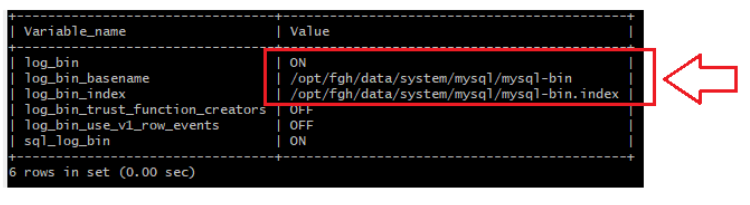

# Introduction
This project hold the necessary stuffs for eip application installation using a docker container. The eip application run in a container called openmrs-eip-sender. The container has the ability to pickup updates for eip application. The new releases (routes, jar, scripts, etc) must be put in [release_stuff](./release_stuff) directory. The release update mechanism check the information in [release_info.sh](./release_stuff/scripts/release_info.sh) script. So, every time there is a new release the information in this script must be changed. 

# Prerequisites
Note: before you go for upgrade and eip installation you may want to run the inconsistences check agaist the openmrs db. Please refere to [Running inconsistence check session](#inconsistence_check). 

To have the eip application run, the mysql bin-logs must be active in the remote openmrs database.

If you are using openmrs instance based on [this docker project](https://github.com/FriendsInGlobalHealth/openmrs-docker-2x) follow the steps bellow:
<ol>
        <li>
                Enter the docker project directory using a command
                <ul>
                        <code>cd /opt/openmrs/appdata/openmrs-docker-2x</code>
                </ul>
        </li>
        <li>
                Stop the containers using the command
                <ul>
                        <code>docker-compose stop</code>
                </ul>
        </li>
        <li>
                Edit the file mysql/mysql.cnf in docker project adding 3 lines under [mysqld] group:           
                <pre>    
                log-bin=mysql-bin.log
                binlog_format=row
                server-id=1000
                </pre>
        </li>
        <li>
                Still inside the root of docker project, run the command
                <ul>
                        <code>docker-compose up --build -d</code>
                </ul>
        </li>
        <li>
                After this, the 3 lines added  in step 3 must apear in “~/.my.cnf” file inside dabase container.
        </li>
        <li>
                After rebuilding the containers you should check if the bin-logs is up running the instrunction bellow in mysql database
                <ul>
                        <code>show variables like '%log_bin%';</code>
                </ul>
        </li>
</ol> 
 The result should be as shown in the image
        
 

# Setup

Create a eip user

<code>sudo useradd -m -d /home/eip -s /bin/bash -G sudo,docker eip</code>

Define a password for eip user

<code>sudo passwd eip</code>

Now login as eip user

<code>su - eip</code>

Init a git repository in /home/eip directory

<code>git init</code>

Associate the project to related docker project in github

<code>git remote add origin https://github.com/FriendsInGlobalHealth/openmrs-eip-docker.git</code>

Pull the remote project into local directory

<code>git pull origin main</code>

Copy the [./eip.template.env](eip.template.env) file to ./eip.env using the command

<code>cp eip.template.env eip.env</code>

Edit the env in the file copied above putting the correct values for the env variables 

<code>
        
        db_sync_senderId=SENDER_ID
        server_port=SERVER_PORT
        openmrs_db_host=OPENMRS_DB_HOST
        openmrs_db_port=OPENMRS_DB_PORT
        openmrs_db_name=OPENMRS_DB_NAME
        spring_openmrs_datasource_password=OPENMRS_DB_USER
        spring_artemis_user=ACTIVE_MQ_USER
        spring_artemis_password=ACTIVE_MQ_PASSWORD
        origin_app_location_code=ORIGIN_APP_LOCATION_CODE
</code>

            

 The SENDER_ID codes can be found [here](https://docs.google.com/spreadsheets/d/1RjOwLWiE_0KGI34tZE-YmIHsf9lY_Lj9/edit?usp=sharing&ouid=117402189670664436672&rtpof=true&sd=true). Use <code>Server_Code</code> column.
        
# Running the project
To run the project for the first time hit the bellow command inside of the eip user home directory (/home/eip)
        
        docker-compose up -d
        
Follow the logs using

<code>docker exec -it openmrs-eip-sender tail -f /home/eip/shared/logs/eip/openmrs-eip.log</code>
        
# Notes
If you notice some issue installing the application create a daemon.json file in location /var/lib/docker and put bellow code

{
  
        "dns": ["8.8.8.8"]
  
}

Depending on your docker environment this file could be in /etc/docker/daemon.json

# Running inconsistence check

This docker project is packed with the inconsistency check module (epts-sync). The rountine to check the inconsistences run in separeted docker service which is defined in [docker-compose-inconsistence-check.yml](docker-compose-inconsistence-check.yml) file.

To run the inconsistence check you must define the following env variables under the "environment" session in the mentioned file.

            - origin_app_location_code=SITE_NAME
            - openmrs_db_host=OPENMRS_DB_HOST
            - openmrs_db_port=OPENMRS_DB_PORT
            - openmrs_db_name=OPENMRS_DB_NAME
            - spring_openmrs_datasource_password=OPENMRS_PASSWORD

Then hit the command

<code>docker-compose -f docker-compose-inconsistence-check.yml up -d</code>

Follow the logs using the command bellow

<code>docker exec -it epts-inconsistence-check tail -f /home/eptssync/logs/log.txt</code>

# Migrating old eip installation to docker based one

Login as eip user using the terminal

<code>su - eip</code>

Stop the eip application and remove the eip service

<code>sudo systemctl stop eip</code>

<code>sudo systemctl disable eip</code>

Now create a old-staff directory and put all old stuff there.

<code>mkdir old_staff</code>

<code>mv * old_staff</code>

Now Follow the [setup](#setup) instructions. Note that you will not need to create eip user!! 

